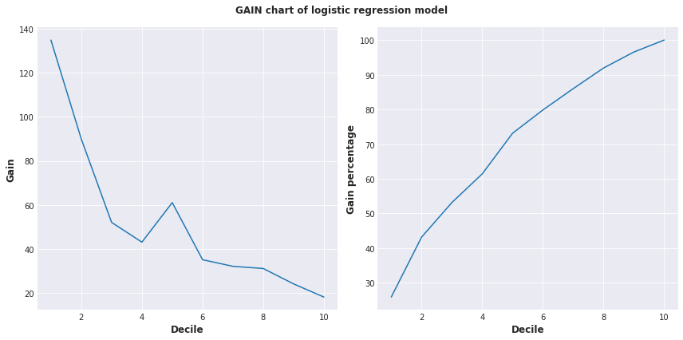
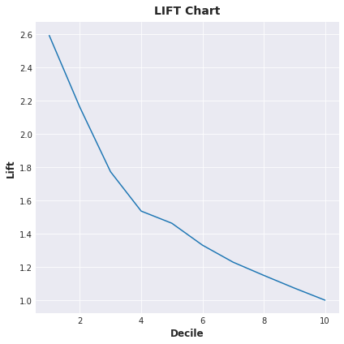

# Bank Target Marketing - Gain & Lift Chart Analysis

A machine learning project focused on improving marketing efficiency using logistic regression, Gain & Lift chart evaluation, and decision tree visualization on a real-world banking dataset.

---

## Table of Contents

- [Overview](#-overview)
- [Key Concepts](#-key-concepts)
- [Dataset](#-dataset)
- [Technologies Used](#-technologies-used)
- [Project Structure](#-project-structure)
- [Installation & Setup](#-installation--setup)
- [How to Run](#-how-to-run)
- [Results & Outputs](#-results--outputs)
- [Use Cases](#-use-cases)
- [References](#-references)
- [License](#-license)

---

## Overview

This project demonstrates how to apply a **logistic regression** model to a real-world **bank marketing dataset** to predict customer response to marketing campaigns. Due to the **low response rate** in such campaigns, it becomes essential to evaluate and optimize the model using tools such as:

- **Gain Chart** – to measure how well the model captures actual positive responses.
- **Lift Chart** – to compare model effectiveness against random targeting.
- **Decision Tree Visualization** – to understand model decision-making behavior.

By identifying the most likely responders, businesses can significantly **reduce marketing costs** while increasing the success rate of campaigns.

---

## Key Concepts

### Gain

> Measures the cumulative proportion of positive responses up to a decile compared to the total positives in the dataset.

**Formula:**

GAIN = (Cumulative positives up to decile i) / (Total positives)


### Lift

> Compares the model’s performance with a baseline (random) model at each decile.

**Formula:**

LIFT = (Model cumulative positives at decile i) / (Random cumulative positives at decile i)


## Dataset

- **Source:** [UCI Machine Learning Repository – Bank Marketing Dataset](https://archive.ics.uci.edu/ml/datasets/bank+marketing)
- **Description:** Data from Portuguese bank’s marketing campaigns via phone calls. The task is to predict if a client subscribes to a term deposit.
- **Target Variable:** `y` (yes/no – subscription)


## Technologies Used

| Category         | Libraries / Tools                          |
|------------------|---------------------------------------------|
| Language         | Python 3.x                                  |
| Data Handling    | Pandas, NumPy                               |
| Visualization    | Matplotlib, Seaborn, Graphviz, pydotplus    |
| Machine Learning | scikit-learn (Logistic Regression, Decision Tree) |
| Notebook         | Jupyter Notebook                            |

---

## Project Structure

```bash
.
├── data/
│   └── bank-full.csv
├── notebooks/
│   └── Bank_Marketing_Gain_Lift.ipynb
├── images/
│   └── gain_chart.png
│   └── lift_chart.png
│   └── decision_tree.png
├── requirements.txt
├── README.md
└── LICENSE
````

---

## 🛠 Installation & Setup

1. **Clone the repository:**

```bash
git clone https://github.com/your-username/bank-target-marketing-gain-lift.git
cd bank-target-marketing-gain-lift
```

2. **Install dependencies:**

```bash
pip install -r requirements.txt
```

3. **(Optional) Set up Graphviz on your system:**

* **Windows:** Install [Graphviz](https://graphviz.gitlab.io/download/) and add its `/bin` path to your environment variables.
* **Linux/macOS:** Use a package manager:

```bash
# Ubuntu
sudo apt install graphviz

# macOS
brew install graphviz
```

---

## How to Run

1. Launch Jupyter Notebook:

```bash
jupyter notebook
```

2. Open the notebook file:

```
notebooks/Bank_Marketing_Gain_Lift.ipynb
```

3. Run the cells sequentially to:

   * Load and preprocess the data
   * Train logistic regression & decision tree models
   * Plot Gain and Lift charts
   * Visualize decision tree using Graphviz

---

## Results & Outputs

* Accuracy, Precision, Recall, and F1 Score of the model
* Gain and Lift chart visualizations
* Decision Tree visualization
* Model performance evaluated on marketing effectiveness

Sample Output:





---

## Use Cases

* **Targeted Marketing Strategy**
* **Customer Segmentation**
* **Churn Prediction**
* **Cost-Efficient Customer Acquisition**

---

## References

* UCI Repository: [Bank Marketing Dataset](https://github.com/Neekhil-Raj/Bank-target-marketing-dataset---Gain-Lift-chart/tree/main)
* Book: *Machine Learning Using Python* by U. Dinesh Kumar
* Scikit-learn Documentation: [https://scikit-learn.org/](https://scikit-learn.org/)

---

## 🏷 License

This project is licensed under the [MIT License](LICENSE).

---

> Made with ❤️ for data-driven marketing optimization.
